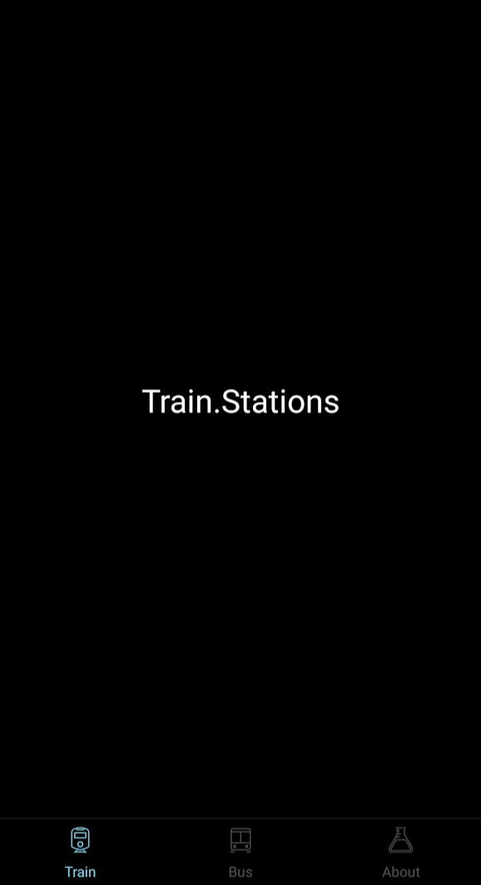

# React Native Boilerplate for Expo

[](https://david-dm.org/chronsyn/react-native-mobx-boilerplate)
[](https://david-dm.org/chronsyn/react-native-mobx-boilerplate?type=dev)
[](http://makeapullrequest.com)

> A React Native boilerplate with Expo, MobX with persistance, and React Navigation. Based on https://github.com/bkdev98/react-native-boilerplate/.



A very similar version of this boilerplate is used in [Panther](https://play.google.com/store/apps/details?id=com.iocube.panther) - a train planner application for the UK (currently not available as public open source). This boilerplate was recreated from the ground up ready for a rewrite of that project.

## Development - Key Concepts

This project uses MobX for state management. Therefore, it uses observable patterns and doesn't require calls such as `setState`. The key concept of state management here is that you can work with the variables directly, in a similar manner to working with a JS object. As long as your screen classes are prefixed with `@observer`, any changes you make to state variables will be reflected.

For example, `myState.myVar = dataFromSomeSource.someField` is the equivalent of `setState({myVar: dataFromSomeSource.someField})`. The difference is that it's more familiar with

Persistence is also available. Check the `Application.State.Mobx.js` file in the `src/store` folder. You will find `@persist` decorators and relevant syntax. Any time these variables are changed, they are persisted to device storage (using `asyncStorage` in this example). Further towards the bottom, you'll find a `const hydrate = create(...)` assignment and some calls to that function further below. This allows the persisted state variables to be restored to the state when the application restarts.

Navigator configuration can be found in `src/Navigator.js`. I've added a lot of comments to various variables but will endeavour to add more as necessary. Please be aware that this project uses version 2 of react-navigation which is vastly different from version 1 so ensure you are referring to the correct API docs.

As of writing, this project does not include a drawer navigator. I removed this from the original fork of the repo as I don't deem drawers to be good UX - devices are held from the bottom, horizontal swiping (to open the menu) is not precise (or easy) with a thumb only, and menu items are almost always aligned to the top. I am a huge fan of reinforcing good UX where I can and so bottom-tab navigation is where I've focused my efforts.

Please note that swiping between tabs is not supported by `createBottomTabNavigator`. You can replace this with `createMaterialBottomTabNavigator` (which is already included and imported) if you prefer, but this library in itself reports some yellow warnings in development which I haven't been able to fix. If anyone figures this out, please submit a PR or open an issue with a solution.

Lodash, moment, moment-duration are available within the project to save installation of some of the more popular libraries.

## Developer notes

This project does not promise to provide everything you might need. I can't account for every possibility out there, but I've made it available to try and allow you to jump straight into development, by providing the core that you can run and several screens which you can start from. I've made each screen use the `@observer` decorator, which means updating and reading state from `ApplicationState` should be as easy as referencing a variable. For example, if you reference `ApplicationState.AppGlobalState.SplashShowing`, you'll be able to change whether the splash screen is showing or not. Usual caveats of development apply and toggling that variable may not make it appears if you're not in a place where it would ever be visible, but it should give you an idea of how easy it is to work with state.

## Demo

- Run with Expo: [React Native Boilerplate](https://expo.io/@chronsyn/react-native-mobx-boilerplate)

## Technologies
- [React Native (Expo)](https://docs.expo.io/versions/latest/)
- [React Navigation (V2)](https://reactnavigation.org/)
- [MobX](https://mobx.js.org)

## Getting Started
Clone this repository
```
$ git clone git@github.com:chronsyn/react-native-mobx-boilerplate.git new-project
```
Install node modules, [Yarn](https://yarnpkg.com/en/) is recommended over NPM.
```
$ yarn
```
Open and start project using [Expo XDE](https://expo.io/tools) or use the [CLI](https://github.com/expo/exp) :
```
$ exp start
```
Run on Android/iOS device or simulator
```
$ exp ios
$ exp android
```
Open project in any [code](https://code.visualstudio.com/) editor and edit as required!


## Contribution
All PRs are welcome 💕

## Contact
- [Twitter](https://twitter.com/chronsyn)

Also available on the expo developers slack
